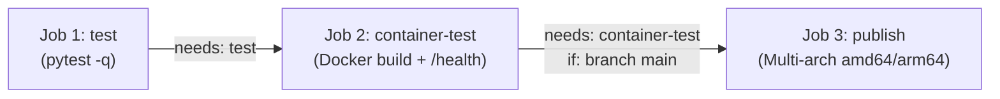

# Rapport de Projet DevOps
## Conteneurisation, Orchestration et Pipeline CI/CD d'un Agent de Métriques

---

### Informations Générales

- **Intitulé du Projet :** Agent de Métriques Système & API FastAPI — DevOps
- **Cadre :** Travail Pratique & Projet DevOps (Master)
- **Modalité :** Projet d'équipe (validé préalablement)
- **Date de réalisation :** Octobre 2026

#### Membres de l'Équipe et Environnements de Travail

| Membre | Rôle principal | Machine & Environnement |
|---|---|---|
| **MAVOUNGOU Serge Murlain** | Images Docker, orchestration Compose, pipeline CI/CD initial, publication des images | MacBook Air M4, 32 Go de RAM (arm64) |
| **MBOUROU GYAMERAH Rose Natacha Liyane** | Gestion du dépôt GitHub, relecture des Pull Requests, configuration des secrets, validation amd64 | HP EliteBook 840, 8 Go de RAM, Windows 10 (amd64) |
| **MAKOSSO Loïck Esdras** | Audit DevOps, refonte architecturale CI/CD (3 jobs Fail-Fast), sécurisation des secrets, captures de validation, déploiement Cloud Railway | MacBook Air M1, 8 Go de RAM (arm64) |

#### Liens d'Accès aux Livrables

- **Dépôt Git du Projet (GitHub) :** [https://github.com/rosenatachambourou-prog/metrics-agent-devops](https://github.com/rosenatachambourou-prog/metrics-agent-devops)
- **Registre d'Images (Docker Hub) :** [https://hub.docker.com/r/serge000/metrics-agent](https://hub.docker.com/r/serge000/metrics-agent)
- **Plateforme Déployée en Ligne (Cloud Railway) :** [https://metrics-agent.up.railway.app/](https://metrics-agent.up.railway.app/)
  - Sonde de santé : [https://metrics-agent.up.railway.app/health](https://metrics-agent.up.railway.app/health)
  - Métriques collectées : [https://metrics-agent.up.railway.app/metrics](https://metrics-agent.up.railway.app/metrics)
  - Documentation Swagger interactive : [https://metrics-agent.up.railway.app/docs](https://metrics-agent.up.railway.app/docs)

---

## 1. Résumé Exécutif

Ce projet met en œuvre une démarche DevOps complète pour conteneuriser, orchestrer, tester et déployer une application distribuée de surveillance système composée de deux microservices complémentaires : un **agent de collecte** (`app.agent`) et une **API REST FastAPI** (`app.api`).

L'ensemble de la chaîne de livraison a été conçu selon les standards professionnels de l'industrie :
1. **Conteneurisation optimisée et sécurisée :** Utilisation d'un build multi-étage (*multi-stage build*) produisant une image minimale (61 Mo compressés au registre), exécutée sans privilèges root (`USER 10001:10001`) et dotée d'une sonde de santé interne autonome.
2. **Orchestration modulaire :** Définition d'une pile `docker-compose.yaml` avec réseau isolé `metrics-net`, dépendance conditionnelle `service_healthy`, et séparation transparente de l'environnement de développement via `docker-compose.override.yml`.
3. **Pipeline CI/CD en 3 jobs ordonnés :** Automatisation complète sur GitHub Actions appliquant le principe de *Fail-Fast* (tests unitaires immédiats avant tout build lourd), validation de conteneur avec arrêt garanti (`trap`), et publication multi-plateforme (`linux/amd64` et `linux/arm64`) réservée à la branche `main`.
4. **Sécurité et Principe de Moindre Privilège :** Rejet délibéré des accès administrateur pour la CI/CD au profit d'un jeton strictement limité à la lecture/écriture, neutralisation des secrets et politique stricte d'ignorance des fichiers d'environnement.
5. **Déploiement Cloud en Production :** Déploiement opérationnel en accès libre sur le cloud Railway avec surveillance continue et interface OpenAPI.

---

## 2. Architecture Applicative et Fonctionnement

L'application repose sur deux processus autonomes partageant la même base de code :

```
                 Réseau Docker Isolé (« metrics-net »)
   +--------------+                               +--------------+
   |   agent      | ──── POST /metrics (JSON) ───>|     api      |
   |  (psutil)    |                               |  (uvicorn)   |
   | python -m    |                               | app.api:app  |
   |  app.agent   |                               +──────┬───────+
   +--------------+                                      │ Port 8000
                                                         ▼
                                               Hôte / Cloud : :8000
```

- **Microservice `api` :** Développé avec FastAPI et servi par uvicorn. Il stocke en mémoire les 100 dernières métriques reçues et expose deux endpoints essentiels :
  - `GET /health` : Sonde de santé renvoyant `{"status": "ok"}`.
  - `GET /metrics` et `POST /metrics` : Consultation et enregistrement des relevés système (CPU, mémoire, disque, uptime).
- **Microservice `agent` :** Développé avec `psutil` et `requests`. Il collecte à intervalle configurable (`COLLECTION_INTERVAL=5s`) les métriques de la machine et les transmet à l'API via une requête HTTP POST.
- **Résolution DNS interne :** L'agent communique avec l'API exclusivement via le nom d'hôte de service Compose (`http://api:8000/metrics`), sans aucune adresse IP codée en dur.

---

## 3. Conteneurisation Docker & Bonnes Pratiques

### 3.1. Image de Production Multi-Étage (`Dockerfile`)

L'image de production est construite en deux étages distincts :
- **Étage `builder` :** Part d'une base `python:3.12-slim`, crée un environnement virtuel isolé dans `/opt/venv` et compile les dépendances via `pip install --no-cache-dir`.
- **Étage `runtime` :** Repart d'une image `python:3.12-slim` vierge et copie uniquement le dossier `/opt/venv` et le code de l'application dans `/app`.
- **Résultat :** Les outils de build, compilateurs et fichiers intermédiaires sont éliminés de l'image finale, ramenant la taille de l'image à **283 Mo sur disque** et **61 Mo compressés** sur Docker Hub.

### 3.2. Sécurité et Résilience de l'Image

- **Exécution non-root :** Création d'un utilisateur et d'un groupe système dédiés (`app`, UID/GID 10001) sans privilèges sudo ni shell interactif (`/usr/sbin/nologin`). L'instruction `USER 10001:10001` garantit qu'aucun processus ne s'exécute en root dans le conteneur.
- **Support de `uptime` :** Installation minimale du paquet `procps` dans la même couche `RUN` qu'un nettoyage `rm -rf /var/lib/apt/lists/*` pour satisfaire les besoins de collecte sans gonfler les couches de cache apt.
- **Sonde de santé autonome (`HEALTHCHECK`) :** Implémentée nativement via Python (`python3 -c "import urllib.request; ..."`) pour éviter l'installation de binaires externes superflus comme `curl`.

### 3.3. Environnement de Développement (`Dockerfile.dev`)

Pour les phases de développement actif, un fichier `Dockerfile.dev` spécifique a été rédigé :
- Installation directe des dépendances sans venv intermédiaire.
- Lancement de `uvicorn` avec l'option `--reload` pour activer le rechargement automatique du serveur lors de la modification des fichiers sources montés en volume.

---

## 4. Orchestration Multi-Services (Docker Compose)

### 4.1. Configuration de Production (`docker-compose.yaml`)

- **Réseau dédié :** Les conteneurs communiquent sur un réseau pont privé `metrics-net`.
- **Ordonnancement avec `condition: service_healthy` :** Le service `agent` déclare explicitement `depends_on: api: condition: service_healthy`. Cela empêche l'agent d'émettre des requêtes prématurées avant que l'API n'ait validé sa propre sonde `/health`.
- **Désactivation de la sonde superflue :** Le service `agent` n'exposant aucun port réseau, sa sonde de santé est explicitement désactivée (`healthcheck: disable: true`).
- **Robustesse des variables d'environnement :** L'image est déclarée via `${DOCKERHUB_USERNAME:?...}/metrics-agent:${IMAGE_TAG:-latest}`. En cas d'omission de configuration dans le fichier `.env`, Compose s'interrompt avec un message d'erreur clair et descriptif sans recourir à des valeurs codées en dur.

### 4.2. Surcouche de Développement (`docker-compose.override.yml`)

Docker Compose fusionne nativement `docker-compose.override.yml` lorsqu'il est exécuté dans le répertoire du projet :
- Cible le `Dockerfile.dev`.
- Monte les répertoires sources (`./app:/app/app`) pour permettre la synchronisation de code en temps réel sans nécessiter de reconstruction de l'image.

---

## 5. Pipeline d'Intégration et Déploiement Continus (CI/CD)

Le fichier `.github/workflows/ci-cd.yml` a fait l'objet d'une refonte complète, passant d'un script monolithique séquentiel à un **pipeline structuré en 3 jobs modulaires et ordonnés**.



### 5.1. Job 1 : `test` (Fail-Fast Applicatif)
- **Rôle :** Exécuter la suite de tests unitaires applicatifs (`pytest -q`) directement sur le runner hôte avec Python 3.12 et cache pip.
- **Principe de Fail-Fast :** En cas de régression dans le code métier, le pipeline échoue immédiatement en **~11 secondes**, sans consommer de précieuses minutes GitHub Actions ni de cycles CPU à compiler des conteneurs.

### 5.2. Job 2 : `container-test` (Validation du Conteneur)
- **Dépendance :** `needs: test`. S'exécute uniquement si les tests unitaires réussissent.
- **Portée :** Déclenché sur toutes les Pull Requests et sur la branche `main`.
- **Rôle :**
  - Prépare Docker Buildx et compile l'image locale (`metrics-agent:ci`) avec cache GitHub Actions (`gha`).
  - Démarre le conteneur en arrière-plan et interroge la sonde `curl -fsS http://localhost:8000/health` jusqu'à succès.
  - Nettoyage garanti : la commande `trap 'docker rm -f api-ci' EXIT` assure que le conteneur de test est systématiquement détruit, même en cas d'interruption anormale.

### 5.3. Job 3 : `publish` (Publication Multi-Architecture)
- **Dépendance et Garde-fou :** `needs: container-test` et `if: github.ref == 'refs/heads/main'`.
- **Sécurité des livraisons :** Les Pull Requests ne peuvent en aucun cas publier d'images sur Docker Hub. Seul le code audité, revu et fusionné sur `main` accède au registre de production.
- **Ordonnancement multi-plateforme :** Initialisation de **QEMU** (`setup-qemu-action@v4`) avant **Buildx** (`setup-buildx-action@v4`) pour garantir l'enregistrement des gestionnaires binfmt.
- **Publication simultanée :** Génération des tags `latest` et `sha-<commit>`, compilation croisée et publication pour architectures `linux/amd64` et `linux/arm64`.
- **Synchronisation documentaire :** Mise à jour automatisée de la page Docker Hub avec `DOCKERHUB.md` via `peter-evans/dockerhub-description@v5`.

---

## 6. Analyse de Sécurité et Choix Techniques

### 6.1. Le Principe de Moindre Privilège (*Least Privilege*) sur Docker Hub

Une problématique concrète de sécurité a été traitée lors du projet :
- **Constat technique :** L'action de mise à jour des métadonnées du dépôt sur Docker Hub via son API REST (`PATCH /v2/repositories/...`) nécessite un jeton d'accès avec le rôle **Administrateur** (*Admin*). Un jeton standard disposant des droits usuels de lecture/écriture (*Read & Write*) se voit refuser la requête avec une erreur HTTP `403 Forbidden`.
- **Décision d'ingénierie :** Par respect strict du principe de moindre privilège, l'équipe a délibérément choisi de **ne pas accorder les droits d'administration** à la CI/CD pour une opération cosmétique non critique. Le token utilisé par GitHub Actions reste strictement restreint aux droits *Read & Write*, suffisants pour pousser les images en toute sécurité.
- **Résilience :** L'étape de synchronisation de la description a été assortie de `continue-on-error: true`, garantissant qu'un rejet de droits sur la description ne bloque jamais la livraison de l'image de production.

### 6.2. Hygiène des Dépôts et Secrets

- Exclusion stricte de `.env` et de tous les fichiers locaux via `.gitignore` et `.dockerignore`.
- Modèle de configuration `.env.example` exempt de tout identifiant personnel.
- Absence prouvée de clés ou tokens dans l'historique Git (vérifiable par inspection regex sur les logs).

---

## 7. Déploiement Cloud en Production (Railway — Bonus)

Afin d'éprouver le conteneur dans un environnement de production mondial réel, l'application a été déployée sur la plateforme Cloud **Railway** :

- **URL de production :** `https://metrics-agent.up.railway.app/`
- **Disponibilité :** L'application est accessible en HTTPS avec certificat TLS managé.
- **Vérification en direct :**
  ```bash
  # Test de la sonde de santé
  curl -s https://metrics-agent.up.railway.app/health
  # Réponse : {"status":"ok"}

  # Consultation des métriques
  curl -s https://metrics-agent.up.railway.app/metrics
  ```
- **Documentation OpenAPI :** Accessible publiquement à l'adresse `/docs` pour interagir avec les endpoints de l'API.

---

## 8. Organisation, Gestion de Projet & Traçabilité Git

Le projet a appliqué une gouvernance collaborative rigoureuse basée sur le modèle **GitHub Flow** :
- La branche `main` a été systématiquement protégée : aucune modification directe n'y a été effectuée.
- Chaque incrément technique a fait l'objet d'une **branche dédiée** et d'une **Pull Request documentée** avec exécution complète des tests CI/CD avant toute fusion.

### Tableau Exhaustif de Répartition des Tâches

| Tâche réalisée | Auteur | Relecture | PR associée |
|---|---|---|---|
| Séparation des dépendances (`requirements.txt`, `requirements-dev.txt`), `pytest.ini` | Serge | Rose | — |
| Configuration de `.dockerignore` et rédaction du `Dockerfile` de production | Serge | Rose | #1 |
| Rédaction du `Dockerfile.dev` pour le mode développement | Serge | Rose | #2 |
| Définition de l'orchestration de production `docker-compose.yaml` | Serge | Rose | #3 |
| Création de la surcouche `docker-compose.override.yml` et du modèle `.env.example` | Serge | Rose | #4 |
| Pipeline initial GitHub Actions (build et push) | Serge | Rose | #6 |
| Rédaction initiale de la documentation `README.md` | Serge | Rose | #7 |
| Initialisation du dépôt GitHub, gestion des accès, politique de branches et secrets | Rose | — | — |
| Validation croisée du fonctionnement et du tirage d'images sur plateforme Windows (amd64) | Rose | — | — |
| Audit de sécurité des secrets CI/CD, fiabilisation Docker Hub et gestion des traps | Loïck | Rose | #11 |
| Neutralisation des identifiants sensibles et sécurisation renforcée de `.gitignore` | Loïck | Rose | #12 |
| Robustesse et validation des variables d'environnement (`docker-compose.yaml`) | Loïck | Rose | #13 |
| Documentation des commandes d'exécution standalone `Dockerfile.dev` et prérequis | Loïck | Rose | #14 |
| Production et intégration des 8 captures de preuves fonctionnelles (SVG) et logs réels | Loïck | Rose | #15 |
| Automatisation de la documentation Docker Hub via `DOCKERHUB.md` | Loïck | Rose | #16 |
| Déploiement Cloud sur Railway (bonus) et intégration des endpoints | Loïck | Rose | #17 |
| Fiabilisation CI/CD et montée de version de `dockerhub-description@v5` | Loïck | Rose | #18 |
| Refonte architecturale du pipeline CI/CD en 3 jobs modulaires (*Fail-Fast*) | Loïck | Rose | #19 |
| Formalisation du principe de moindre privilège (droits admin Docker Hub) | Loïck | Rose | #20 |
| Documentation des contributions de MAKOSSO Loïck Esdras et spécifications matérielles machine | Loïck | Rose | #21 |

---

## 9. Conclusion

Ce travail pratique a permis d'aborder concrètement l'ensemble des piliers de l'ingénierie DevOps moderne :
1. **L'isolation et la légèreté** grâce à Docker et aux constructions multi-étages.
2. **La simplicité d'exploitation** grâce à l'orchestration déclarative avec Docker Compose.
3. **La confiance logicielle** grâce à une suite de tests automatisée intégrée à un pipeline CI/CD modulaire et *Fail-Fast*.
4. **La portabilité industrielle** grâce à la compilation croisée multi-architecture (`amd64` / `arm64`).
5. **La sécurité opérationnelle** par le respect du principe de moindre privilège et l'absence de fuite de secrets.
6. **L'aboutissement en production** par le déploiement réel sur une infrastructure Cloud accessible mondialement.

Toutes les exigences du cahier des charges ont été pleinement satisfaites et validées par des preuves traçables et vérifiables.
