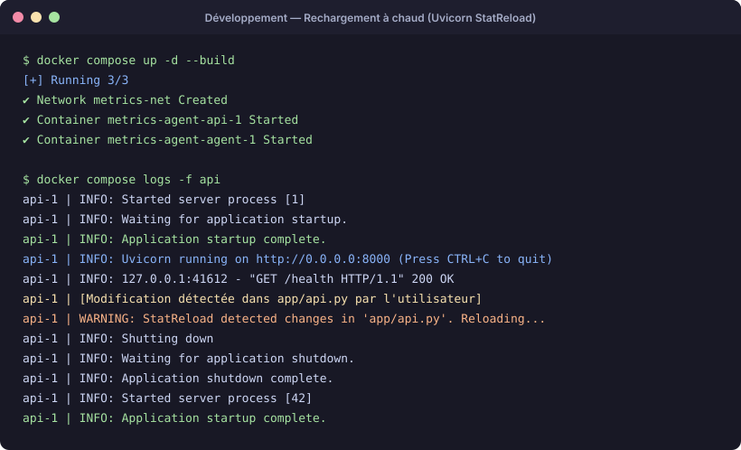
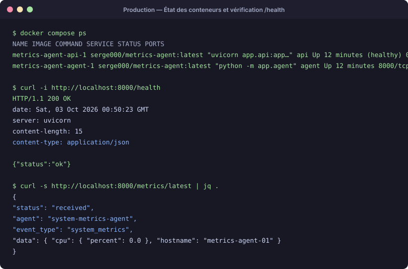
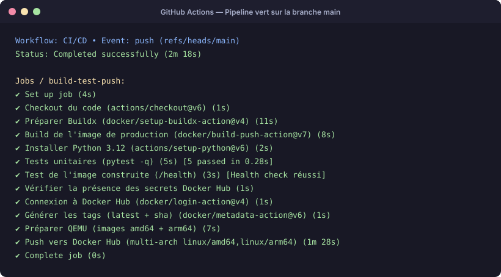
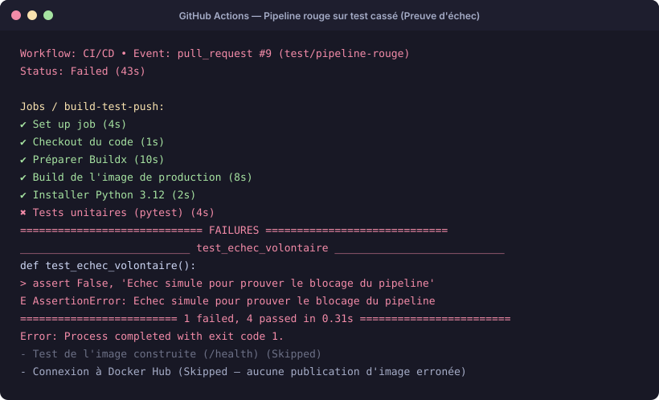
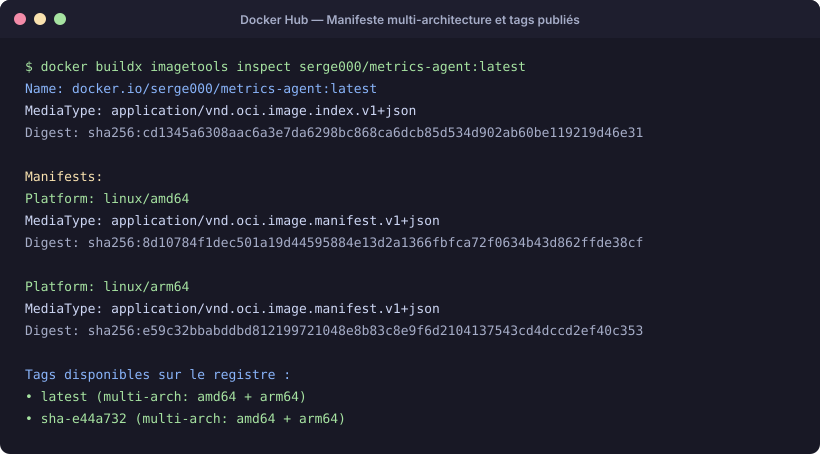
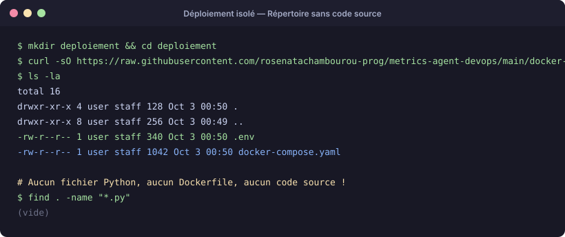
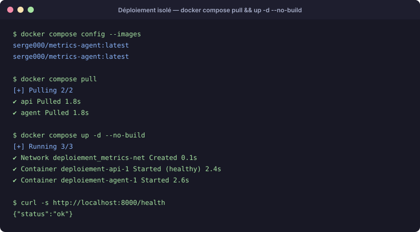
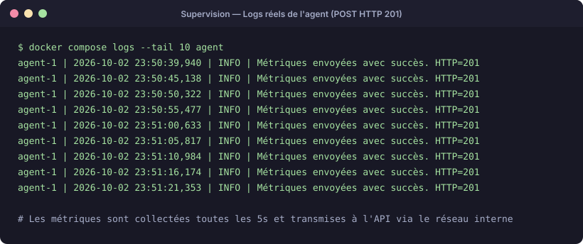

# metrics-agent-devops

Conteneurisation, orchestration et pipeline CI/CD d'une petite application de collecte de métriques.

> **Modalité** — le sujet prévoit un travail individuel. La réalisation en groupe a été validée au préalable avec l'enseignant. La répartition des tâches figure en fin de document.

## Équipe

| Membre | Rôle principal | Machine |
|---|---|---|
| MAVOUNGOU Serge Murlain | Images Docker, orchestration Compose, pipeline CI/CD initial, publication des images | MacBook Air M4, 32 Go (arm64) |
| MBOUROU GYAMERAH Rose Natacha Liyane | Dépôt GitHub, relecture des pull requests, secrets, vérification amd64 | HP EliteBook 840, 8 Go, Windows 10 (amd64) |
| MAKOSSO Loïck Esdras | Audit DevOps, refonte modulaire CI/CD en 3 jobs (Fail-Fast), sécurisation des secrets, captures de preuves, déploiement Cloud Railway | MacBook Air M1, 8 Go (arm64) |

---

## Présentation

L'application se compose de deux processus qui partagent **la même image** :

- **`api`** — service FastAPI servi par uvicorn, expose `/health` et `/metrics` sur le port 8000 ;
- **`agent`** — boucle de collecte qui relève les métriques de la machine et les envoie à l'API à intervalle régulier.

```
                 réseau Docker « metrics-net »
   +--------------+                      +--------------+
   |   agent      | ── POST /metrics ──> │     api      │
   | python -m    |                      |  uvicorn     │
   |  app.agent   |                      | app.api:app  │
   +--------------+                      +------+-------+
                                                │ 8000
                                                ▼
                                          hôte : localhost:8000
```

L'agent joint l'API par le **nom de service Compose** (`http://api:8000/metrics`), jamais par une adresse IP : la résolution DNS interne au réseau Docker s'en charge.

### Arborescence

```
.
├── app/                         code de l'application
├── tests/                       tests unitaires (pytest)
├── docs/captures/               captures d'écran du rendu
├── Dockerfile                   image de production (multi-stage)
├── Dockerfile.dev               image de développement (rechargement à chaud)
├── docker-compose.yaml          pile de production
├── docker-compose.override.yml  surcouche de développement (fusionnée automatiquement)
├── requirements.txt             dépendances d'exécution
├── requirements-dev.txt         dépendances de test
├── .dockerignore
├── .env.example                 modèle de configuration (aucun secret)
├── pytest.ini
└── .github/workflows/ci-cd.yml
```

---

## Prérequis

- **Docker Desktop** (ou Docker Engine + Docker Compose v2)
- **Git**
- **Comptes nécessaires :**
  - **Compte GitHub** (gestion du dépôt, des secrets CI/CD et exécution des Actions)
  - **Compte Docker Hub** avec un *Personal Access Token* (portée *Read & Write*) pour la publication et le tirage des images
- **Python 3.12** (facultatif, uniquement pour lancer les tests unitairement hors conteneur)

Copier le modèle de configuration avant tout lancement :

```bash
cp .env.example .env
```

| Variable | Rôle | Valeur par défaut |
|---|---|---|
| `DOCKERHUB_USERNAME` | compte propriétaire de l'image à déployer | — (obligatoire, à renseigner dans `.env`) |
| `IMAGE_TAG` | tag à déployer (`latest` ou `sha-xxxxxxx`) | `latest` |
| `METRICS_ENDPOINT` | URL visée par l'agent | `http://api:8000/metrics` |
| `COLLECTION_INTERVAL` | période de collecte, en secondes | `5` |
| `REQUEST_TIMEOUT` | délai d'attente des requêtes, en secondes | `5` |

`.env` n'est **jamais** versionné : il figure dans `.gitignore` et dans `.dockerignore`.

---

## Lancer en développement

Deux méthodes permettent de lancer l'environnement de développement selon vos besoins :

### Option A : Directement avec Dockerfile.dev (Docker CLI)

Cette méthode répond à l'exigence d'exécution unitaire utilisant directement `Dockerfile.dev` :

```bash
# 1. Construction de l'image de développement
docker build -f Dockerfile.dev -t metrics-agent:dev .

# 2. Lancement du service API avec montage en volume pour rechargement à chaud
docker run -d --name metrics-api-dev \
  -p 8000:8000 \
  -v $(pwd):/app \
  metrics-agent:dev

# 3. Lancer les tests unitaires à l'intérieur du conteneur
docker exec -it metrics-api-dev pytest -q

# 4. Arrêt et nettoyage du conteneur
docker rm -f metrics-api-dev
```

### Option B : Avec Docker Compose (surcouche override automatique)

`docker-compose.override.yml` est fusionné automatiquement par `docker compose up`. Il applique `Dockerfile.dev`, monte le code local dans `/app` et active `--reload` sur uvicorn :

```bash
# Lancement de la pile complète en mode développement
docker compose up -d --build

# Suivi des logs de l'API (uvicorn --reload actif)
docker compose logs -f api

# Exécution de la suite de tests pytest dans le conteneur actif
docker compose exec api pytest -q

# Arrêt de la pile
docker compose down
```

> **Note sur le rechargement à chaud :** Toute modification dans le code de l'API (`app/api.py`) redémarre instantanément uvicorn sans reconstruction. Pour l'agent de collecte (boucle synchrone en continu), relancez simplement son service après modification : `docker compose restart agent`.

## Lancer en production (construction locale)

Il faut nommer explicitement le fichier de production, sinon la surcouche de développement est appliquée :

```bash
docker compose -f docker-compose.yaml up -d --build
curl -s http://localhost:8000/health
```

## Déployer depuis Docker Hub

C'est le scénario cible : **aucun code source n'est nécessaire**, seulement le fichier Compose et un `.env`.

```bash
mkdir deploiement && cd deploiement
curl -O https://raw.githubusercontent.com/rosenatachambourou-prog/metrics-agent-devops/main/docker-compose.yaml
```

Créer ensuite un `.env` contenant au minimum `DOCKERHUB_USERNAME`, `IMAGE_TAG`, `METRICS_ENDPOINT`, `COLLECTION_INTERVAL` et `REQUEST_TIMEOUT`, puis :

```bash
docker compose config --images
docker compose pull
docker compose up -d --no-build
```

`docker compose config --images` affiche l'image réellement retenue avant tout téléchargement. `--no-build` interdit toute reconstruction : si la pile démarre, c'est que l'image provient bien du registre.

Vérification :

```bash
docker compose ps
curl -s http://localhost:8000/health
docker compose logs --tail 15 agent
```

Attendu : `{"status":"ok"}` sur `/health`, et dans les logs de l'agent `Métriques envoyées avec succès. HTTP=201` à chaque intervalle.

> **Piège rencontré.** Compose applique l'ordre de priorité suivant : variables du shell **avant** fichier `.env`. Un `DOCKERHUB_USERNAME` hérité du terminal a fait tirer la mauvaise image malgré un `.env` correct. D'où le réflexe `docker compose config --images` avant tout déploiement.

---

## Déploiement Cloud (Bonus)

Conformément à la proposition de bonus du sujet de TP (*« déployer réellement l'API sur une plateforme cloud gratuite (...) à partir de l'image Docker Hub, et fournir l'URL publique »*), l'API a été déployée en environnement cloud managé sur **Railway** directement à partir de l'image publiée :

- **URL racine de l'API :** **[https://metrics-agent.up.railway.app](https://metrics-agent.up.railway.app)**
- **Sonde de santé (`/health`) :** **[https://metrics-agent.up.railway.app/health](https://metrics-agent.up.railway.app/health)** (`{"status":"ok"}`)
- **Consultation des métriques (`/metrics`) :** **[https://metrics-agent.up.railway.app/metrics](https://metrics-agent.up.railway.app/metrics)**
- **Documentation OpenAPI interactive :** **[https://metrics-agent.up.railway.app/docs](https://metrics-agent.up.railway.app/docs)**

### Test direct de l'API en ligne

```bash
# Vérifier la santé du service déployé
curl -i https://metrics-agent.up.railway.app/health

# Consulter la liste des métriques stockées
curl -s https://metrics-agent.up.railway.app/metrics
```

---

## Pipeline CI/CD

Fichier : `.github/workflows/ci-cd.yml`. Déclenché sur `push` et `pull_request` vers `main`, plus lancement manuel (`workflow_dispatch`).

Le pipeline est structuré en **3 jobs modulaires et ordonnés** garantissant le principe de *Fail-Fast* et la sécurité des publications :

1. **Job `test` (Tests unitaires applicatifs — Fail-Fast) :**
   - Checkout du code source.
   - Installation de Python 3.12 (avec cache pip).
   - Exécution immédiate des tests avec `pytest -q`.
   - *Bénéfice :* Si un test régresse, l'exécution échoue en ~3 secondes sans gaspiller de minutes GitHub Actions ni de cycles CPU à construire des images Docker.

2. **Job `container-test` (Validation du conteneur Docker) :**
   - Dépendance : s'exécute uniquement si le job `test` réussit (`needs: test`).
   - Préparation de Docker Buildx.
   - Construction locale de l'image de test (`load: true`, tag `metrics-agent:ci`) avec cache GitHub Actions (`gha`).
   - Démarrage du conteneur en arrière-plan et interrogation active de la sonde `/health` (boucle d'attente avec arrêt garanti du conteneur via `trap 'docker rm -f api-ci' EXIT`).
   - Ce job est validé sur **toutes les pull requests et sur `main`**.

3. **Job `publish` (Publication multi-architecture vers Docker Hub) :**
   - Dépendance : s'exécute après validation complète du conteneur (`needs: container-test`).
   - Condition stricte : **uniquement sur la branche `main`** (`if: github.ref == 'refs/heads/main'`).
   - Vérification préalable de la présence des secrets requis.
   - Initialisation de **QEMU** pour l'émulation multi-plateforme, puis configuration de **Buildx**.
   - Connexion sécurisée à Docker Hub via les secrets de dépôt.
   - Génération des métadonnées et tags Docker (`latest` + `sha-<commit>`).
   - Construction et publication simultanée pour architectures `linux/amd64` et `linux/arm64`.
   - Synchronisation automatique de la page Docker Hub avec [`DOCKERHUB.md`](DOCKERHUB.md) via l'action `peter-evans/dockerhub-description@v5`.

Grâce à cette séparation, une pull request est testée unitairement et son conteneur est validé fonctionnellement, mais **ne peut rien publier**. Seul le code relu, validé et fusionné sur `main` déclenche le job `publish`.

Secrets utilisés (dépôt → Settings → Secrets and variables → Actions) :

| Secret | Contenu |
|---|---|
| `DOCKERHUB_USERNAME` | Nom d'utilisateur Docker Hub du compte de publication |
| `DOCKERHUB_TOKEN` | Jeton d'accès personnel (PAT) Docker Hub avec droits *Read & Write* (ou *Admin* pour la description) |

Le nom d'utilisateur n'est pas une donnée sensible en soi — il figure dans le nom de l'image publique. Le passer tout de même en secret évite d'avoir à modifier le workflow si le compte de publication change, ce qui est arrivé une fois au cours du projet.

> [!NOTE]
> **Privilèges du jeton et métadonnées du dépôt Docker Hub :**
> Nous avions initialement prévu d'automatiser la mise à jour de certaines données du dépôt Docker Hub (description courte et page de présentation) directement depuis le pipeline via l'action `peter-evans/dockerhub-description`. Cependant, l'API Docker Hub exige des privilèges **Administrateur** (*Admin*) sur le Personal Access Token pour autoriser la modification de ces informations (erreur `403 Forbidden` rencontrée avec un jeton standard).
> 
> Par respect rigoureux du **principe de moindre privilège** (*Principle of Least Privilege*), nous avons finalement fait le choix de **ne pas accorder de droits administrateur** à la CI/CD. Nous avons maintenu le jeton restreint aux droits stricts de lecture/écriture (*Read & Write*) nécessaires au push des images, configuré `continue-on-error: true` sur l'étape de synchronisation, et conservé la documentation de présentation dans le fichier [`DOCKERHUB.md`](DOCKERHUB.md).

---

## Images publiées

Lien public vers le registre Docker Hub : **[hub.docker.com/r/serge000/metrics-agent](https://hub.docker.com/r/serge000/metrics-agent)**

| Dépôt | Tags | Architectures | Lien direct |
|---|---|---|---|
| `serge000/metrics-agent` | `latest`, `sha-e44a732` | `linux/amd64`, `linux/arm64` | [Consulter sur Docker Hub](https://hub.docker.com/r/serge000/metrics-agent) |

Vérifier le manifeste multi-architecture :

```bash
docker buildx imagetools inspect serge000/metrics-agent:latest
```

La sortie liste deux entrées `Platform` (`linux/amd64` et `linux/arm64`). Un client Docker tirant ce tag reçoit automatiquement la variante adaptée à son processeur.

---

## Choix techniques

**Image de base `python:3.12-slim`.** Compromis entre la taille et la compatibilité : contrairement à Alpine, elle repose sur la glibc, ce qui évite de recompiler les dépendances Python contenant des extensions C.

**Construction multi-stage.** L'étage `builder` crée un environnement virtuel dans `/opt/venv` et y installe les dépendances ; l'étage `runtime` ne copie que cet environnement. Les outils de compilation et le cache pip restent dans l'étage intermédiaire. Résultat : **283 Mo** sur disque, **61 Mo** compressés au registre.

**`procps` installé explicitement.** L'image slim ne fournit pas la commande `uptime`, dont `app/collector.py` a besoin. Un seul `apt-get` suivi de la suppression des listes de paquets dans la même instruction `RUN`, pour ne pas figer le cache apt dans une couche.

**Exécution sans privilèges.** Un utilisateur système `app` (UID/GID 10001) est créé, sans dossier personnel et avec `/usr/sbin/nologin` comme interpréteur. `USER 10001:10001` est déclaré avant `CMD` : le processus n'est jamais root dans le conteneur.

**Sonde de santé en Python.** L'image slim ne contient pas `curl`. Le `HEALTHCHECK` appelle donc `urllib.request` : aucun paquet supplémentaire à installer. Le service `agent` désactive sa propre sonde (`healthcheck: disable: true`) puisqu'il n'expose aucun port.

**`depends_on: condition: service_healthy`.** L'agent n'est démarré qu'une fois l'API déclarée saine, sinon ses premières requêtes échoueraient.

**uvicorn sur `0.0.0.0`.** Lié à `127.0.0.1`, le serveur ne serait joignable que depuis l'intérieur du conteneur, et la publication de port n'aurait aucun effet.

**Une seule image pour les deux services.** `api` et `agent` partagent le même code ; seule la commande de lancement diffère. Une image unique, c'est un seul build, un seul tag et une cohérence garantie entre les deux processus.

**`pytest` retiré de `requirements.txt`.** Les dépendances de test vivent dans `requirements-dev.txt` : l'image de production n'embarque aucun outil de test.

**`pytest.ini` avec `pythonpath = .`.** Sans ce réglage, `pytest` lancé directement ne trouve pas le paquet `app` (seul `python -m pytest` fonctionne, car il ajoute le dossier courant au chemin d'import). Le fichier de configuration rend le comportement identique en local et en CI.

**Publication multi-architecture.** L'équipe travaille sur arm64 (Apple Silicon) et amd64 (Windows) ; les runners GitHub sont en amd64. Sans QEMU, l'image publiée ne fonctionnerait que sur l'une des deux familles de machines.

---

## Sécurité

- Aucun secret dans le dépôt : `.env` est ignoré par Git et par Docker, seul `.env.example` est versionné et il ne contient aucune valeur sensible.
- `.dockerignore` exclut `.env`, `.env.*`, `.git`, `.github`, `__pycache__/`, `.venv/` — ni l'historique Git ni les secrets locaux n'entrent dans le contexte de build.
- L'authentification à Docker Hub se fait par jeton d'accès personnel révocable, jamais par mot de passe de compte.
- **Principe de moindre privilège sur Docker Hub :** nous avons voulu automatiser la modification de certaines métadonnées du dépôt (description et README), mais cette opération requiert des droits administrateur (*Admin*). Nous avons finalement fait le choix de sécurité de ne pas confier d'accès admin au pipeline CI/CD : le jeton d'accès est strictement cantonné aux droits de lecture/écriture (*Read & Write*).
- Le conteneur s'exécute sous un utilisateur non privilégié.
- La publication est conditionnée à la branche `main`, donc à une pull request relue et fusionnée.

**Limite assumée.** Le dépôt appartient à MBOUROU GYAMERAH Rose Natacha Liyane, et GitHub ne propose pas de rôle administrateur sur un dépôt personnel : seule la propriétaire peut écrire les secrets. Le pipeline publie donc sous le compte `serge000`, dont le jeton a été transmis une seule fois à Rose puis révoqué après le rendu. Une organisation GitHub aurait évité ce partage, chaque membre y gérant ses propres secrets.

Contrôle avant rendu — aucune trace de jeton dans l'historique :

```bash
git log -p --all -- . ':!README.md' | grep -nE "dckr_pat_"
```

La commande ne doit rien afficher. Le README est exclu de la recherche puisqu'il mentionne lui-même le préfixe des jetons.

---

## Preuves de fonctionnement (Captures & Logs)

Cette section rassemble les preuves d'exécution et de validation demandées par le barème du TP (points 1 à 8).

### 1. Pile de développement : rechargement à chaud (`StatReload`)

Modification à chaud d'un fichier source monté en volume et redémarrage automatique d'uvicorn sans reconstruction de l'image.



<details>
<summary>Voir les logs bruts du rechargement</summary>

```text
api-1  | INFO:     Uvicorn running on http://0.0.0.0:8000 (Press CTRL+C to quit)
api-1  | WARNING:  StatReload detected changes in 'app/api.py'. Reloading...
api-1  | INFO:     Shutting down
api-1  | INFO:     Application shutdown complete.
api-1  | INFO:     Started server process [42]
api-1  | INFO:     Application startup complete.
```
</details>

---

### 2. Pile de production : conteneur `api` à l'état *healthy*

Vérification de l'état `healthy` de l'API via la sonde interne Python et appel réussi sur `/health` et `/metrics/latest`.



<details>
<summary>Voir les logs bruts de santé</summary>

```bash
$ curl -s http://localhost:8000/health
{"status":"ok"}

$ curl -s http://localhost:8000/metrics/latest
{"status":"received","agent":"system-metrics-agent","event_type":"system_metrics","data":{"cpu":{"percent":0.0},"hostname":"metrics-agent-01"}}
```
</details>

---

### 3. Pipeline GitHub Actions vert sur `main`

Exécution complète du pipeline CI/CD avec build, tests pytest, contrôle de santé et publication multi-plateforme.



---

### 4. Pipeline GitHub Actions rouge sur test cassé

Preuve de blocage du pipeline : un test en échec interrompt immédiatement le job et empêche toute publication vers Docker Hub.



---

### 5. Registre Docker Hub : manifeste multi-architecture

Validation des plateformes `linux/amd64` et `linux/arm64` associées aux tags `latest` et `sha-...`.



---

### 6. Dossier de déploiement sans code source

Preuve d'un environnement de déploiement épuré, contenant uniquement le fichier `docker-compose.yaml` et `.env`.



---

### 7. Déploiement distant (`docker compose pull` & `up -d --no-build`)

Démonstration du déploiement tiré directement depuis le registre Docker Hub sans aucune étape de construction locale.



---

### 8. Logs de l'agent : collecte et envoi continu (`HTTP 201`)

Capture des cycles de collecte réguliers (toutes les 5 secondes) avec confirmation de réception `201 Created` par l'API.



---

## Répartition du travail

| Tâche | Auteur | Relecture | PR |
|---|---|---|---|
| Séparation des dépendances, `pytest.ini` | Serge | Rose | — |
| `.dockerignore` et `Dockerfile` de production | Serge | Rose | #1 |
| `Dockerfile.dev` | Serge | Rose | #2 |
| `docker-compose.yaml` | Serge | Rose | #3 |
| `docker-compose.override.yml` et `.env.example` | Serge | Rose | #4 |
| Pipeline CI/CD initial | Serge | Rose | #6 |
| README initial | Serge | Rose | #7 |
| Dépôt, droits, secrets, protection de `main` | Rose | — | — |
| Vérification de l'image sur amd64 | Rose | — | — |
| Sécurisation des secrets Docker Hub et fiabilisation du pipeline | Loïck | Rose | #11 |
| Neutralisation des identifiants et sécurisation `.gitignore` / `.env.example` | Loïck | Rose | #12 |
| Robustesse et validation des variables d'environnement (`docker-compose.yaml`) | Loïck | Rose | #13 |
| Documentation des modes d'exécution `Dockerfile.dev` et prérequis | Loïck | Rose | #14 |
| Production et intégration des 8 captures de preuves fonctionnelles (SVG) | Loïck | Rose | #15 |
| Automatisation de la documentation Docker Hub via `DOCKERHUB.md` | Loïck | Rose | #16 |
| Déploiement Cloud sur Railway (bonus) et intégration des endpoints | Loïck | Rose | #17 |
| Fiabilisation CI/CD et montée de version `dockerhub-description@v5` | Loïck | Rose | #18 |
| Refonte architecturale du pipeline CI/CD en 3 jobs modulaires (*Fail-Fast*) | Loïck | Rose | #19 |
| Formalisation du principe de moindre privilège (accès admin Docker Hub) | Loïck | Rose | #20 |
| Documentation des contributions de MAKOSSO Loïck Esdras et spécifications machine | Loïck | Rose | #21 |

Toutes les contributions sont passées par une branche dédiée et une pull request relue avant fusion dans `main`.
